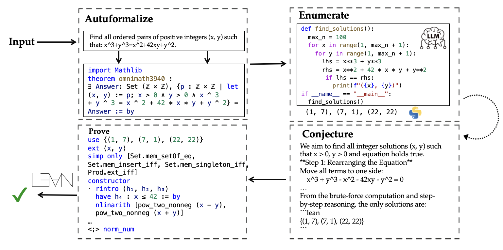
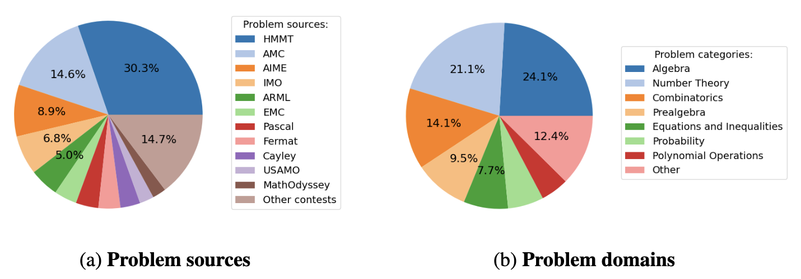
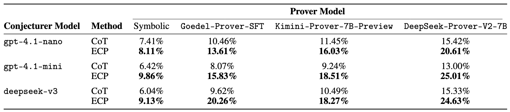

<h1 align="center">
🔍 Enumerate–Conjecture–Prove: Formally Solving Answer-Construction Problems in Math Competitions
</h1>

<p align="center">
  <a href="https://huggingface.co/datasets/sunjia72/ConstructiveBench" target="_blank"></a>
  <a href="https://arxiv.org/abs/2505.18492" target="_blank"></a>
  <a href="https://github.com/JackSun200312/ECP" target="_blank"></a>
</p>

## Summary
- **Background**: We identify that current mathematical reasoning approaches either generate creative answers (LLMs) but fail to verify them formally, or verify rigorously (symbolic provers) but cannot efficiently generate answers.
- **Contribution**: 
  - We introduce **ECP framework**: a modular neuro-symbolic pipeline that integrates a feedback-driven autoformalization stage, LLM-based enumeration and conjecturing, and theorem-proving in Lean.
  - We introduce **ConstructiveBench**: an autoformalized dataset of 3,431 competition-grade answer-construction problems, each includes informal and formal problem statements, ground-truth answers and metadata, enabling end-to-end formal verification (answer-construction + theorem-proving).




## Datasets

### ConstructiveBench

- **Location**: `data/dataset/constructivebench.json`  
- **Description**: Curated Olympiad-style problems with metadata and aligned Lean formalizations. Each entry includes:
  - Problem statement
  - Category (e.g., Algebra, Combinatorics)
  - Formal answer in Lean
  - Full formal theorem
  - Answer-construction alignment parts (header, answer, theorem with/without answer)

```json
{
  "name": "IMO2011SLC4",
  "category": "Combinatorics",
  "source": "IMO/2011",
  "problem": "...",
  "answer": "The greatest such number k is 3",
  "formalization": "...",
  "...": "..."
}
```
Below, we show the problem sources and problem domains in ConstructiveBench.


### PutnamBench (Answer-Construction Subset)

- **Location**: `data/dataset/putnam.json`  
- **Description**: A selected subset of answer-construction problems from the PutnamBench dataset, chosen to evaluate the ECP pipeline on university-level problems.


## Experiment Overview

We show the end-to-end answer-construction ("Conjecturer Model") and theorem proving ("Prover Model") accuracy with Pass@32 metric on 3,431 ConstructiveBench problems, comparing the CoT baseline vs. ECP for answer-construction. 


## Requirement

- Python 3.10  
- CUDA >= 11.8  
- Git LFS  
- Lean Proof Assistant 
- (Optional) Chrome and Chrome Driver  


## Environment Setup

1. **Initialize Git LFS**  
   (Skip if already set up.)  
   ```bash
   git lfs install
   ```

2. **Install Lean**  
   (Skip if already set up.)  
   ```bash
   curl https://raw.githubusercontent.com/leanprover/elan/master/elan-init.sh -sSf | sh
   source ~/.bashrc
   ```
   Verify installation:
   ```bash
   lean --version
   ```

3. **Clone the Repository**  
   ```bash
   git clone --recursive https://github.com/JackSun200312/ECP
   cd ECP
   ```

4. **Create a Python Virtual Environment**  
   We recommend using `venv`:
   ```bash
   python -m venv imosolver
   source imosolver/bin/activate
   pip install -r requirements.txt
   ```

5. **Build Lean Environment**  
   Build for both the newest version and `v4.9.0-rc1` (for prover models). This may take around 30 minutes.

   ```bash
   cd Formalization
   lake update
   lake build Main
   cd ..

   cd prover/mathlib4
   lake build
   cd ../..
   ```

6. **Set Up LLM API Keys**  
   Either add them to your shell file or edit `appl.yaml` directly:
   ```bash
   echo 'export OPENAI_API_KEY="your_openai_key_here"' >> ~/.bashrc
   echo 'export DEEPSEEK_API_KEY="your_deepseek_key_here"' >> ~/.bashrc
   source ~/.bashrc
   ```


## File Structure

```
ECP/
├── prover/                         # Adapted from Goedel-Prover, contains utilities for running prover models
├── src/
│   └── ecp/
│       ├── agent.py                # Multi-agent framework for Enumerate → Conjecture → Prove (ECP)
│       ├── main.py                 # Main entry point for experiments
│       └── utils.py                # Utility functions
│   └── scripts/
│       ├── dataset/
│       ├── deploy/
│       ├── finetune/
│       ├── lean/
│       └── trace/
└── data/
    └── dataset/
        ├── constructivebench.json  # ConstructiveBench dataset
        └── putnam.json             # PutnamBench answer-construction subset
```


## Example Runs

The file `src/ecp/main.py` provides a unified interface for three pipelines:

1. **`answer_gen`**: Full ECP pipeline (Enumerate → Conjecture → Verify)  
2. **`autoformalize`**: Generate Lean formalizations from informal problems/answers  
3. **`proof_gen`**: Use a formal prover to generate complete Lean proofs  

### 1. Input Dataset

- Use `--problem_path` to specify the dataset.  
  - Main option: `constructivebench` (recommended)  
  - For testing: `test` (runs a single case)

### 2. Choosing the Pipeline

- Set `--mode` to one of:
  - `answer_gen`  
  - `autoformalize`  
  - `proof_gen`  

### 3. Key Flags

- `--enable_enumerator`:  
  - `True`: Run full ECP (enumerator + conjurer)  
  - `False`: Skip enumeration (Chain-of-Thought baseline)  
- `--problem_name`:  
  - `"all"` (default) to process all entries  
  - Or a comma-separated list of specific problem names  


### Example Commands

#### A. Run Autoformalization

```bash
python src/ecp/main.py     --mode autoformalize     --problem_path constructivebench
```

#### B. Run Answer-Generation (ECP Pipeline)

```bash
python src/ecp/main.py     --mode answer_gen     --problem_path constructivebench     --enable_enumerator true
```
> **Output Location**:  
> `output/data/dataset/constructivebench.json/deepseek-chat-code/`  
> (*To run the CoT baseline, set `--enable_enumerator false`.*)

#### C. Run Proof-Generation (Prove)

After generating formalizations and conjectures (via `answer_gen`), run:

```bash
python src/ecp/main.py     --mode proof_gen     --problem_path constructivebench
```
> **Note**: Proof generation uses Goedel-Prover by default. You can override with models like `deepseek-ai/DeepSeek-Prover-V2-7B` or `AI-MO/Kimina-Prover-Preview-Distill-7B`.


## Default Models & Parameters

- `--enumerator_model`: `deepseek-chat`  
- `--conjecturer_model`: `deepseek-chat`  
- `--prover_model`: `Goedel-LM/Goedel-Prover-SFT`  
- `--max_tokens`: `500`  
- `--timeout`: `60` (seconds)  
- `--pass_at_n`: `32` (Pass@n metric for proof generation)  
- `--gpu`: `1` (number of GPUs for proof generation)  
- `--use_embedding_search`: `False`  
  (Set to `True` only if you have GPU resources for embedding-based Lean retrieval.)

You can override any of these options. Check `src/ecp/main.py` for the full list of arguments.


## Summarize

After experiments, summarize answer/proving accuracies for a dataset (`constructivebench`, `putnam`, or `test`):

```bash
python summarize_result.py --base <dataset>
```


## Citation

If you find this work useful, please cite:

```bibtex
@misc{sun2025enumerateconjectureproveformallysolvinganswerconstruction,
  title        = {Enumerate-Conjecture-Prove: Formally Solving Answer-Construction Problems in Math Competitions},
  author       = {Jialiang Sun and Yuzhi Tang and Ao Li and Chris J. Maddison and Kuldeep S. Meel},
  year         = {2025},
  eprint       = {2505.18492},
  archivePrefix= {arXiv},
  primaryClass = {cs.AI},
  url          = {https://arxiv.org/abs/2505.18492},
}
```


## Acknowledgement

This paper was developed using code from [Goedel-Prover](https://github.com/Goedel-LM/Goedel-Prover) for proof generation utilities.
